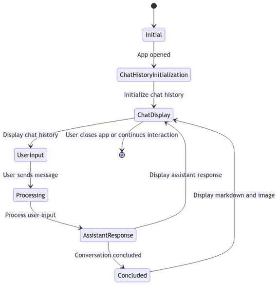
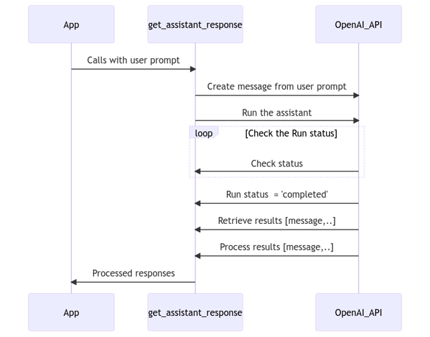

# GPT Insurance Assistant

## Description

Create Assistant AI with OpenAI 

## Installation

Instructions on how to install the project.

```bash
pip install -r requirements.txt
```

To start application

```bash
streamlit run Welcome.py
```

## App Flow


## OpenAI Flow

